# [2026-07-03] 안드로이드 모바일 프로그래밍 자율학습 과제

## 주제: 토스증권 UX 기반 투자 시각화 앱 요구사항 정의서

### 1. 유사 앱 분석 (최소 3개)

국내 대표 핀테크 및 증권사 애플리케이션의 UI/UX 구조와 데이터 시각화 방식을 비교 분석합니다.

| 앱 이름 | 주요 기능 및 장점 | 단점 및 한계점 |
| --- | --- | --- |
| **토스증권** | * 라인 차트 중심의 극단적 미니멀리즘 UI<br>

<br>* '주식 모으기' 등 직관적인 적립식 투자 여정 제공<br>

<br>* 복잡한 금융 용어를 배제하여 진입 장벽 최소화 | * HTS급 기술적 보조지표(**RSI**, **MACD** 등) 분석 불편<br>

<br>* 고밀도 데이터 스크리닝 및 호가 데이터 시각화의 깊이 부족 |
| **카카오페이증권** | * 카카오톡 생태계 기반의 계좌 연동 및 편리한 접근성<br>

<br>* 차트와 주문 프로세스의 시각적 단순화 | * 독립적인 트레이딩 전용 기능의 부재<br>

<br>* 심층 리포트 및 투자 정보 탐색 레이아웃 제한 |
| **나무증권 (NH)** | * 전문 투자자용 HTS급 차트 지표 및 실시간 호가 정보 제공<br>

<br>* 강력한 조건 검색(스크리닝) 기능 | * 다중 계층 뷰(Nesting Layout)로 인한 화면 복잡도 상승<br>

<br>* 초보 사용자가 접근하기 어려운 높은 진입 장벽 |

### 2. 벤치마킹 대상 선정 및 이유

* **선정 앱:** 토스증권 (Toss Securities)
* **선정 이유:** 15주간의 모바일 프로그래밍 프레임워크 내에서 고밀도 실시간 금융 데이터를 직관적인 미니멀 UI로 풀어내는 레이아웃 설계 능력을 입증하기에 가장 적합함. 중첩 레이아웃을 배제하고 `ConstraintLayout`을 이용한 평탄한 계층 구조(Flat Hierarchy) 구현과 `TableLayout` 기반의 재무 지표 시각화 학습 목적에 완벽히 부합하여 최종 벤치마킹 대상으로 선정함.

### 3. 주요 구현 기능 및 화면 흐름도 (10개 화면 완결)

안드로이드 SDK 컴포넌트 구조와 뷰 매커니즘을 고려하여 레퍼런스 이미지 자산을 매핑한 10개 화면 아키텍처 명세입니다.

---

#### 1) 스플래시 및 생체 인증 화면 (Splash & Biometric Activity)

* **컴포넌트:** `BiometricPrompt` API, `ConstraintLayout`
* **기능 명세:** 앱 초기 진입 시 보안 레이어를 구동하고 생체 인증 환경을 제공합니다.
* **레퍼런스 이미지:** *(보안 인프라 공통 레이어로 별도 캡처 미배치)*

```text
┌──────────────────────────────────────────┐
│           [ Splash / 로고 연출 ]          │
│                    ⬇                     │
│       [ BiometricPrompt 보안 모달 ]      │
└──────────────────────────────────────────┘


* 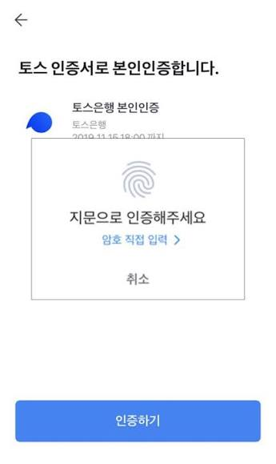

```

---

#### 2) 자산 대시보드 홈 프래그먼트 (Main Dashboard Fragment)

* **컴포넌트:** `LinearLayout` (Vertical), `CardView`
* **기능 명세:** 사용자의 기본 계좌 원화/달러 예수금 및 총투자 평가 금액과 당일 실시간 손익 데이터를 동적 카드 형태로 표현합니다.


* **레퍼런스 이미지 매핑:**
* 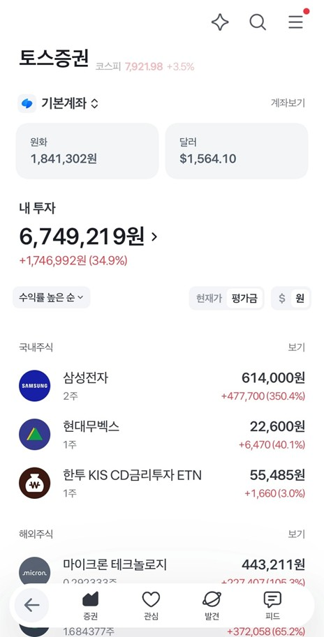


---

#### 3) 실시간 종목 발견 화면 (Stock Discovery Fragment)

* **컴포넌트:** `RecyclerView`, `DiffUtil`
* **기능 명세:** 국내외 주식 시장의 실시간 거래대금, 거래량, 급상승, 급하락 순위 데이터를 UI 스레드 중단 없이 리스트로 드로잉합니다.
* **레퍼런스 이미지 매핑:**
* 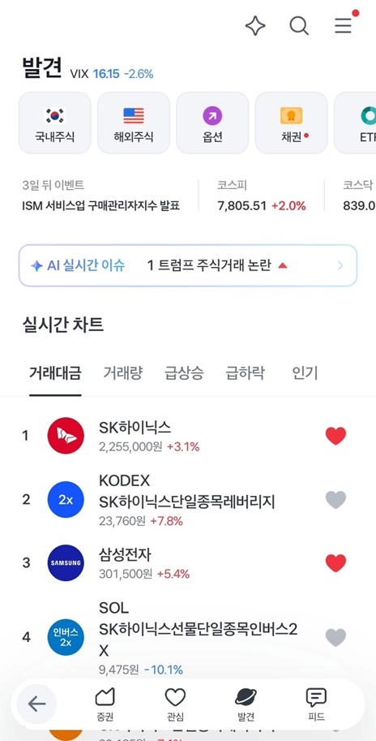


---

#### 4) 미니멀 종목 상세 화면 (Stock Detail Activity)

* **컴포넌트:** `com.github.mikephil.charting.charts.LineChart`
* **기능 명세:** 축 지표를 과감히 제거하고 1일, 1주, 3달, 1년 단위의 가격 변동 곡선만 매끄러운 캔버스로 시각화합니다.
* **레퍼런스 이미지 매핑:**
* 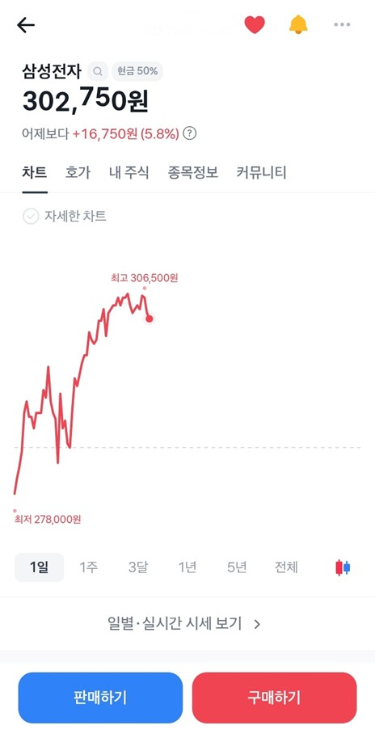


---

#### 5) 기술적 보조지표 상세 화면 (Advanced Chart View)

* **컴포넌트:** `CandleStickChart`, `ViewStub`
* **기능 명세:** 종목 차트 영역 내 '자세한 차트' 제어 플래그 감색 시 캔들스틱 및 거래량 이동평균선 격자를 하단에 동적 렌더링합니다.
* **레퍼런스 이미지 매핑:**
* 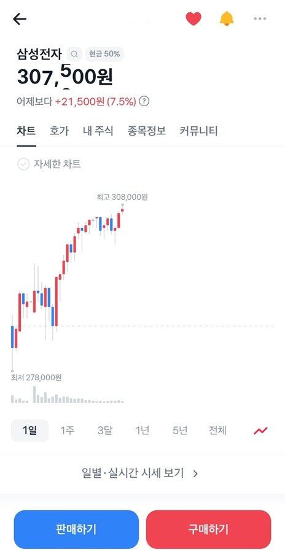


---

#### 6) 기업 가치 재무 분석 탭 (Financial Metrics Fragment)

* **컴포넌트:** `TableLayout`, `TableRow`
* **기능 명세:** **PER**, **PBR**, **ROE** 등 핵심 투자 지표 데이터와 당일 시세(최저, 최고, 시작, 종가, 거래량) 및 투자자 동향 격자를 2열 구조로 시인성 있게 출력합니다.
* **레퍼런스 이미지 매핑:**
* 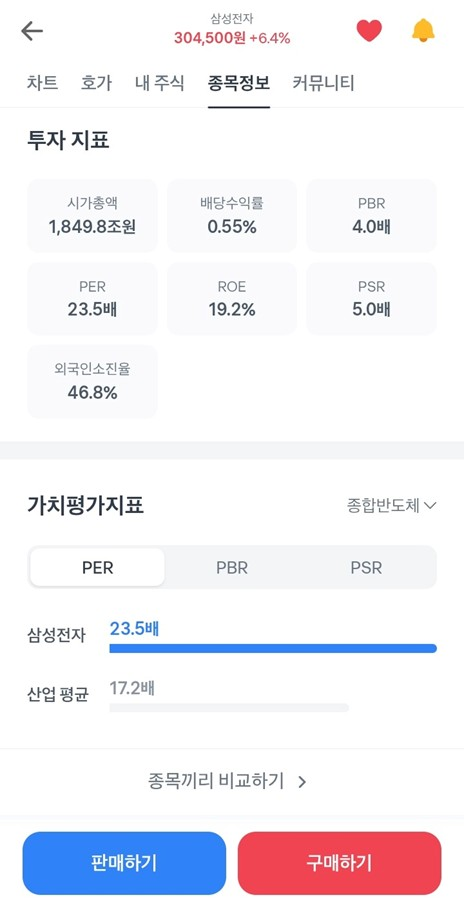


---

#### 7) 투자 뉴스 및 AI 요약 정보 화면 (Investment News CardView)

* **컴포넌트:** `NestedScrollView`, `CardView`
* **기능 명세:** 상단 레이아웃 내에 토스증권 AI 실시간 이슈 브리핑 시그널 배너를 탑재하고 스크롤 흔들림 제어 기능이 적용된 카드 뷰 형태로 뉴스를 바인딩합니다.
* **레퍼런스 이미지 매핑:**
* 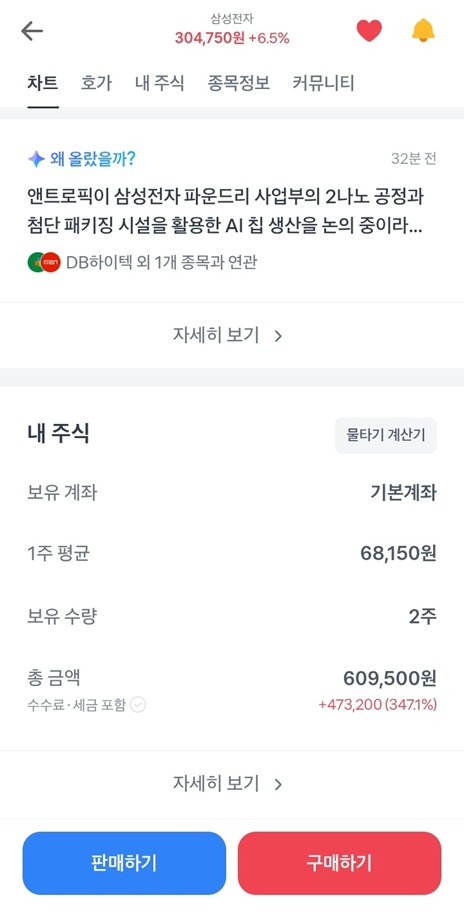


---

#### 8) 원터치 간편 매수/매도 주문 폼 (Order BottomSheetDialogFragment)

* **컴포넌트:** `BottomSheetDialog`, `InsetsController`
* **기능 명세:** 최하단 영역에 고정된 구매하기/판매하기 버튼 상호작용 시 화면 밖 이탈이 차단된 상태로 슬라이딩 오픈되는 주문 인터페이스 창구입니다.
* **레퍼런스 이미지 매핑:**
* 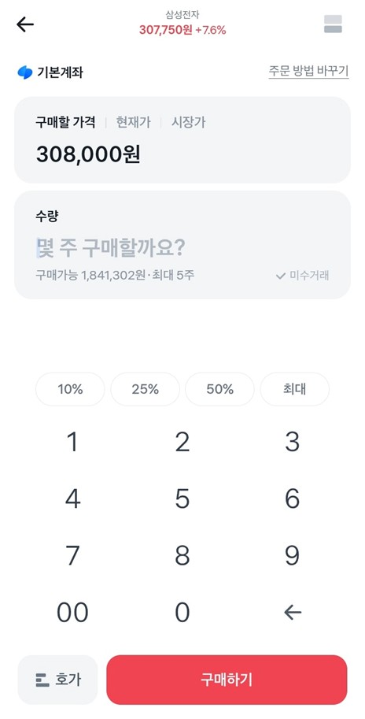
* 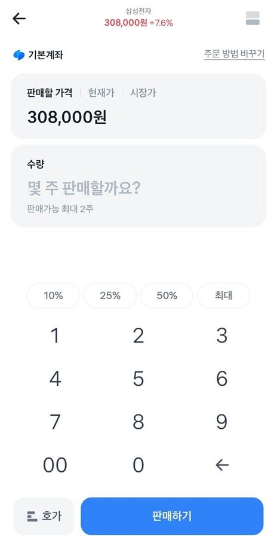


---

#### 9) 적립식 주식 모으기 설정 화면 (Auto Investment Scheduler Form)

* **컴포넌트:** `ConstraintLayout`, FSM State Tracker
* **기능 명세:** 투자 주행 상태 머신(Sealed Class)을 기반으로 올웨더, 워렌버핏 등 포트폴리오 단위 혹은 개별 종목 주식 모으기 스케줄을 예약 제어합니다.
* **레퍼런스 이미지 매핑:**
* 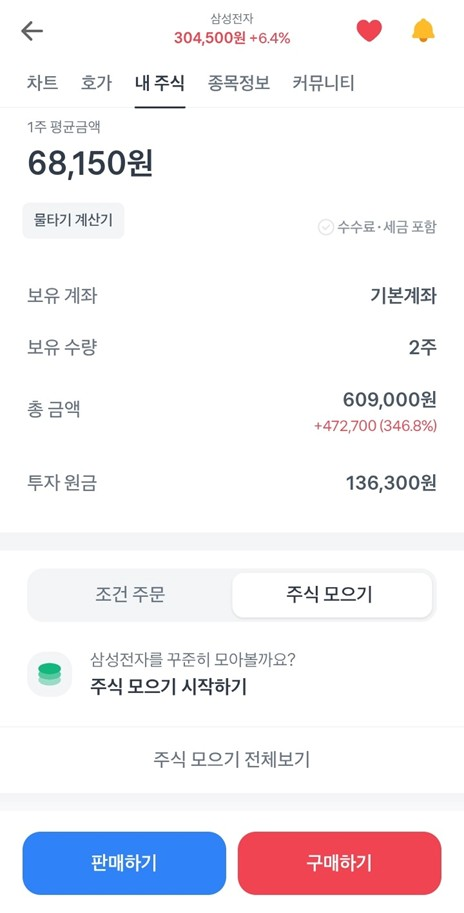
* 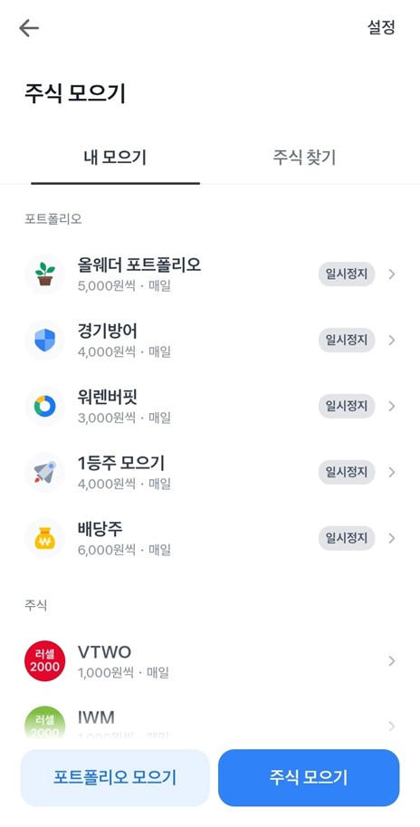

---

#### 10) 보유 주식 손익 평가 포트폴리오 화면 (Portfolio Matrix View)

* **컴포넌트:** `ConstraintLayout`, `DataBinding`
* **기능 명세:** 매수 평균가(평단가)와 현재 시장 평가액 변동 추이를 실시간 연산하여, 투자 수익률이 양수이면 Red, 음수이면 Blue로 시스템 캐시 컬러 코드를 타겟 매핑하여 실시간 출력합니다.
* **레퍼런스 이미지 매핑:**
* 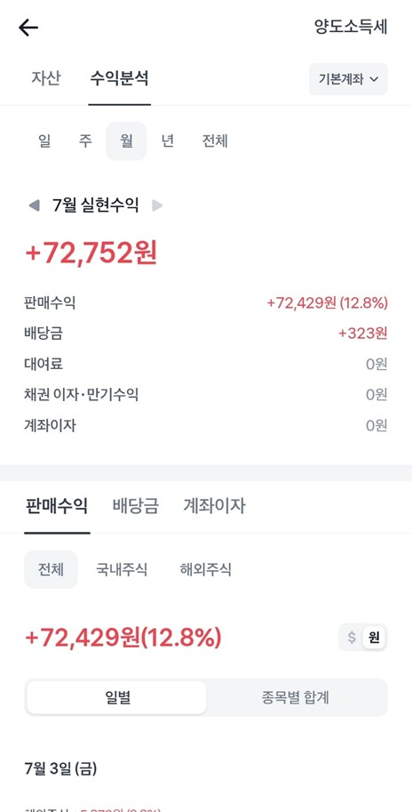
* 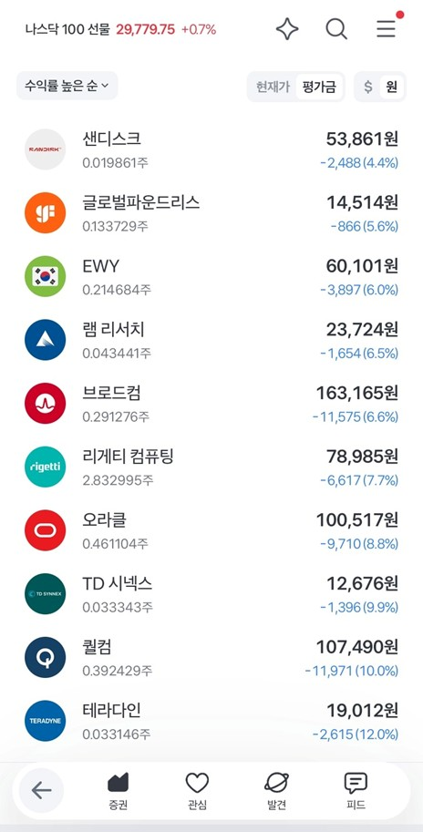
* 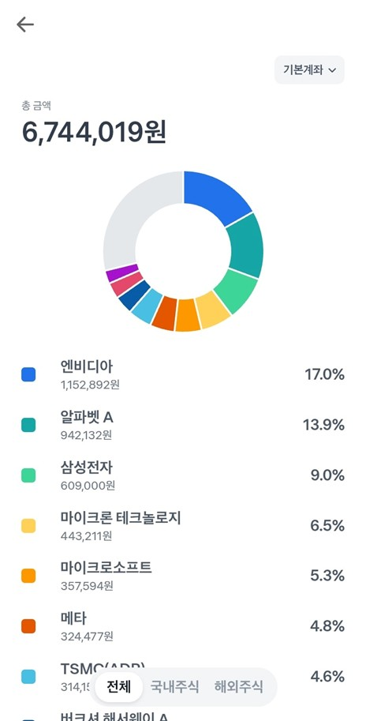


---

### 4. 개발 제약 사항 및 도구

* **IDE:** Android Studio Ladybug (2024.2.1) 이상 타겟팅
* **Language:** Kotlin (JDK 17)
* **UI Architecture:** View Binding 구조 적용 (레이아웃 인플레이트 에러 및 Null 가드 확보)
* **Core UI Component:** `ConstraintLayout` (최상위 컨테이너 제약 조건 처리), `TableLayout` (재무 격자 데이터 전용)
* **External Library:** `MPAndroidChart` (실시간 라인 및 캔들 차트 드로잉 엔진)